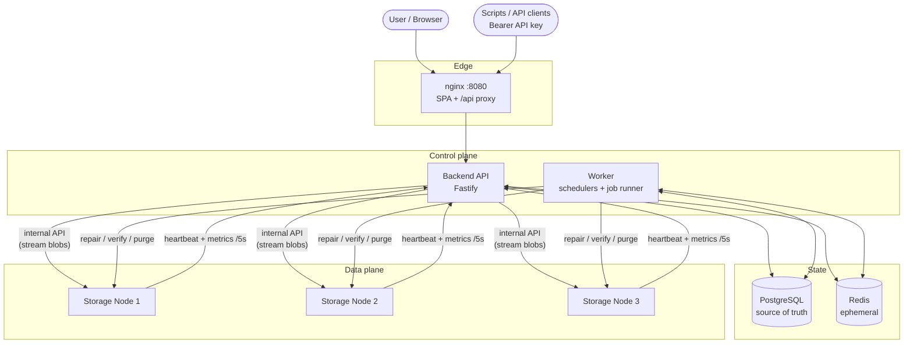
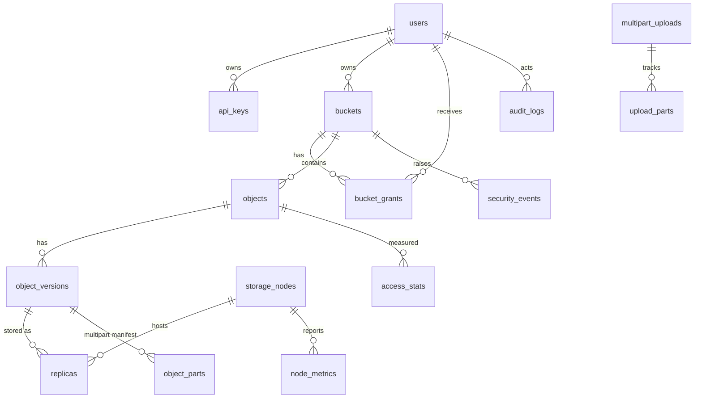
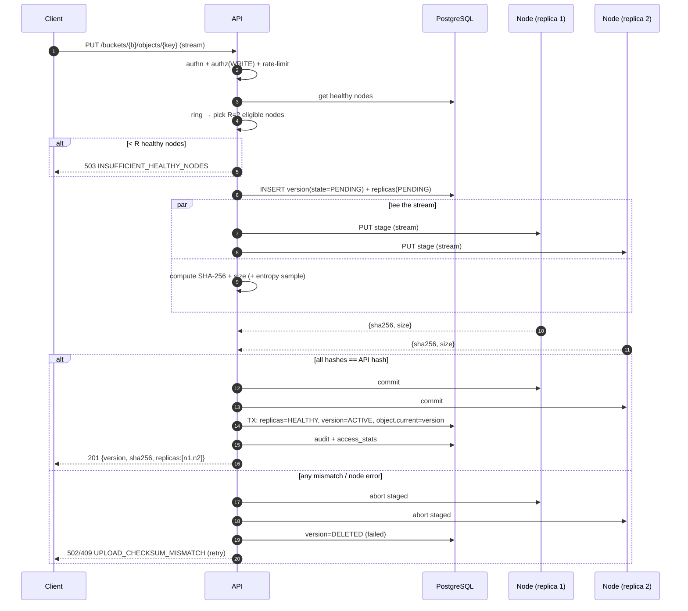
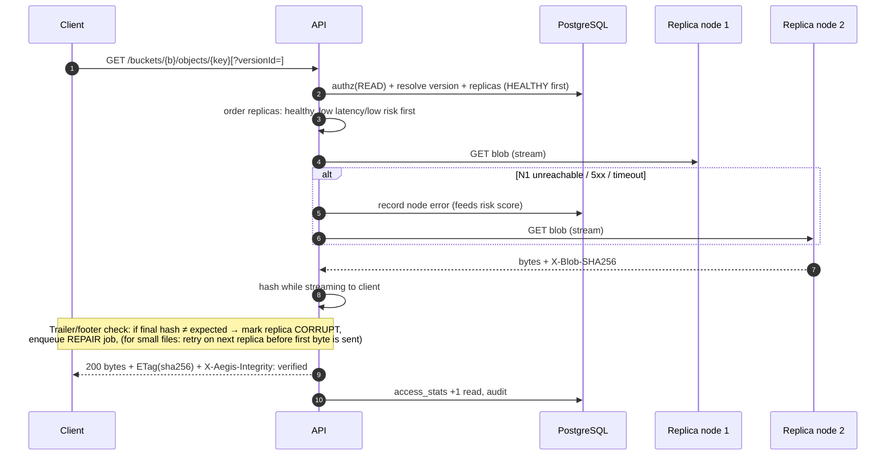
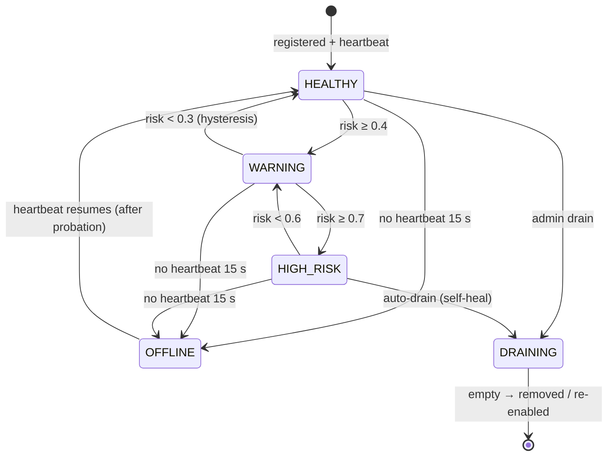
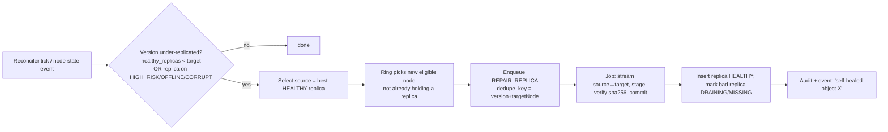

# AegisStore — System Architecture

> Status: **v0.2: Batch 1 (Phases 1–5) implemented** · Date: 2026-10-03
> Where the implementation differs from this design, see **§17 As built**.
> Source: *AegisStore — Current User Manual (Batch 1, Phases 1–5)*
> Scope: the **whole** system — Batch 1 foundation **and** the intelligent features still to build.

---

## 0. How to read this document

| Section | Answers |
|---|---|
| 1 | What are we building and what do we need? (requirements) |
| 2 | Which technologies, and why? |
| 3–4 | What are the pieces and how are they laid out? |
| 5 | What is stored where? (data model) |
| 6–7 | How does placement, upload, download, and failure handling work? |
| 8–9 | How do the "intelligent" features work? |
| 10–12 | API, security, realtime, observability |
| 13–15 | Deployment, testing, build roadmap |
| 16 | Open questions that need a decision from you |

Items marked **[B1]** are Batch 1 (Phases 1–5, already described as "working" in the manual).
Items marked **[B2]** are the "baaki hai" (remaining) features.

---

## 1. Requirements

### 1.1 Product summary

AegisStore is an S3-inspired **distributed object store**. Files (objects) live in buckets, are split across several **Storage Nodes** instead of one server, are **replicated**, **checksum-verified (SHA-256)**, and survive node failures. Metadata lives in PostgreSQL. The final product adds *predictive failure detection, self-healing, adaptive replication, and ransomware/anomaly protection*.

### 1.2 Functional requirements

**Core storage [B1]**

| ID | Requirement |
|---|---|
| FR-1 | Register/login; roles `MEMBER` (self-signup) and `ADMIN` (seeded from `.env`). |
| FR-2 | Create / list / search / open / delete buckets. Bucket flags: `versioning`, `public_read`. Only empty buckets can be deleted. |
| FR-3 | Upload objects (with progress, optional key prefix), download, delete, search, filter (class / integrity), sort, paginate. |
| FR-4 | Each object version is stored on **R = 2** distinct healthy nodes chosen by a **consistent hash ring** (128 vnodes/node). If fewer than 2 healthy nodes → reject with `503`. |
| FR-5 | SHA-256 verified on upload (every replica must match) and on download. A bad replica is marked `CORRUPT`. |
| FR-6 | Download falls back to another healthy replica when the first is unavailable or corrupt. |
| FR-7 | Object details: size, content-type, SHA-256, integrity, replica list (node, path, checksum match), version list. |
| FR-8 | Storage Nodes send heartbeat + metrics every **5 s**; Worker marks a node `OFFLINE` after **15 s** without one. |
| FR-9 | Node status page: HEALTHY / OFFLINE, CPU, memory, disk, latency, error rate, last heartbeat, hash-ring share, health history. |
| FR-10 | Dashboard: total/used storage, object count, healthy vs at-risk nodes, per-node usage chart, node-health donut, recent activity. |
| FR-11 | Permissions: owner, `READ/WRITE/ADMIN` grants, public-read buckets — enforced server-side. |
| FR-12 | API keys: create/revoke in Settings; used as `Authorization: Bearer <token>`. |
| FR-13 | Audit log: every security-relevant action recorded. |

**Remaining features [B2]**

| ID | Requirement |
|---|---|
| FR-20 | **Versioning (complete):** list versions, restore an old version, download a specific version, delete markers. |
| FR-21 | **Multipart upload** for files > 100 MB. |
| FR-22 | **Signed URLs:** time-limited, login-free share links. |
| FR-23 | **Advanced permissions:** UI to manage grants (API already exists). |
| FR-24 | **Node health monitoring (complete):** `HEALTHY / WARNING / HIGH_RISK / OFFLINE` + trend history. |
| FR-25 | **Predictive failure / risk score** per node from its metrics. |
| FR-26 | **Automatic self-healing:** re-replicate objects away from risky/offline/corrupt nodes. |
| FR-27 | **HOT / WARM / COLD classification** from access frequency. |
| FR-28 | **Adaptive replication:** raise/lower replica count by class. |
| FR-29 | **Ransomware / anomaly detection:** spot mass delete/overwrite/high-entropy writes. |
| FR-30 | **Protected version recovery:** pre-attack versions are immutable and restorable. |
| FR-31 | **Security events** page with alerts for review. |
| FR-32 | **Audit logs page:** filter + search. |
| FR-33 | **Simulation Lab:** inject node faults and traffic from the UI. |
| FR-34 | **Analytics:** storage growth, access classes, replication activity. |
| FR-35 | **Live updates** via SSE (replaces 5 s polling). |
| FR-36 | **Retention cleanup:** purge deleted/overwritten data after 24 h. |

### 1.3 Non-functional requirements

| ID | Requirement | Target |
|---|---|---|
| NFR-1 | **Durability** | No acknowledged upload is lost if any single node dies. |
| NFR-2 | **Integrity** | No silent corruption: every read is verified or served from a verified replica. |
| NFR-3 | **Availability** | Reads succeed with ≥ 1 healthy replica; writes need ≥ R healthy nodes. |
| NFR-4 | **Metadata durability** | Postgres is the single source of truth. **Redis loss must never lose data** (cache/live-metrics only). |
| NFR-5 | **Streaming** | Never buffer whole files in memory; constant memory per transfer. |
| NFR-6 | **Failure detection** | OFFLINE within ~15–20 s; self-heal begins ≤ 60 s later. |
| NFR-7 | **Security** | Argon2id passwords, hashed API keys, server-side authz on every request, audit trail, internal node API authenticated. |
| NFR-8 | **Observability** | Structured logs, request IDs, health endpoints, metrics endpoint. |
| NFR-9 | **Reproducibility** | `cp .env.example .env && docker compose up --build` gives a full working system. |
| NFR-10 | **Testability** | Fault scenarios are scriptable and run in CI (`verify-e2e`). |

### 1.4 What we need to start (prerequisites)

| Need | Choice / status |
|---|---|
| Runtime | Node.js 22 LTS (✅ present: v22.22), pnpm |
| Containers | Docker + Compose v2 (✅ present: 29.6) |
| Database | PostgreSQL 16, Redis 7 (via Compose) |
| Repo | Monorepo, branch `claude/brave-thompson-dxbe0t` (✅ empty, clean slate) |
| CI | GitHub Actions: lint, typecheck, unit, integration, e2e (compose) |
| Decisions | See §16 |

### 1.5 Non-goals (v1)

- Real multi-host / multi-region clustering (nodes are containers on one Compose network).
- Erasure coding (we use plain N-way replication).
- Full S3 API compatibility (S3-*inspired*; own REST API; S3 shim is a later option).
- Encryption at rest / KMS (listed as future work, §15).

---

## 2. Technology decisions

| Layer | Choice | Why |
|---|---|---|
| Language | **TypeScript** everywhere | One language for API, worker, node, UI; shared types. |
| Monorepo | **pnpm workspaces** (+ Turborepo optional) | Shared `packages/*`, one install. |
| API / Worker / Node HTTP | **Fastify** | Fast, streaming-friendly, schema validation, plugin model. |
| Validation | **Zod** (shared schemas) | Same schema validates API input and types the UI client. |
| DB access | **Drizzle ORM** + `drizzle-kit` migrations | Type-safe SQL, close to raw SQL, easy migrations. |
| Database | **PostgreSQL 16** | Metadata, audit, jobs (SKIP LOCKED). |
| Cache / live data | **Redis 7** | Latest node metrics, pub/sub for SSE, rate limits. Ephemeral by design. |
| Job queue | **Postgres `jobs` table** (`FOR UPDATE SKIP LOCKED`) | Keeps Redis disposable (NFR-4); jobs survive restarts. |
| Frontend | **React + Vite + TypeScript**, TanStack Query, React Router, Tailwind, shadcn/ui, Recharts | Matches manual (React dashboard, charts, donut). |
| Edge | **nginx** (serves SPA, proxies `/api` → API) on `:8080` | One origin, no CORS pain. |
| Auth | Argon2id, JWT in `httpOnly` cookie (dashboard), hashed API keys (Bearer) | See §10. |
| Logging | **pino** (JSON) | Structured, request-id correlation. |
| Testing | **Vitest**, **Testcontainers**, **Playwright** | Unit / integration / UI. |
| Lint/format | ESLint + Prettier + `tsc --noEmit` | CI gate. |

> Alternative worth noting: Go for the Storage Node (smaller footprint). Rejected for v1 to keep one toolchain; the node's wire protocol (§7) is language-agnostic so it can be swapped later.

---

## 3. System context & components



### 3.1 Component responsibilities

| Component | Responsibility | Never does |
|---|---|---|
| **Dashboard (React)** | UI, calls `/api/*`, subscribes to SSE. | Talk to nodes or DB. |
| **nginx** | Serve static SPA, reverse-proxy API, set body-size/timeouts. | Business logic. |
| **Backend API** | AuthN/Z, bucket/object logic, placement, streaming proxy to nodes, checksum verification, audit, SSE, heartbeat ingest. | Run long background loops. |
| **Worker** | Health sweeper, risk scoring, reconciler/self-heal, classifier, anomaly detector, retention purge, job runner, metrics rollups. | Serve user requests. |
| **PostgreSQL** | Users, buckets, objects, versions, replicas, nodes, jobs, audit, security events. | — |
| **Redis** | Latest node metrics (TTL), pub/sub, rate-limit counters, short-lived caches. | Hold anything that can't be rebuilt. |
| **Storage Node** | Store/serve/verify/delete blobs on local disk; compute SHA-256; heartbeat; expose chaos hooks (lab). | Know about users, buckets, or object names. |

**Key principle:** *nodes are dumb, the control plane is smart.* A node only knows `blob_id → bytes`. All placement, permission, and healing intelligence lives in API/Worker. This makes nodes replaceable and the system testable.

### 3.2 Why API proxies the bytes (and doesn't hand out node URLs)

- Permissions are enforced in one place.
- API can verify checksums and fall back between replicas transparently.
- Nodes need not be reachable from the browser.
- Cost: API bandwidth is the bottleneck (acceptable for v1; direct-to-node presigned transfer is a documented future optimization).

---

## 4. Repository layout

```
aegisstore/
├─ apps/
│  ├─ api/              # Fastify backend
│  │  └─ src/
│  │     ├─ modules/{auth,users,apikeys,buckets,objects,versions,
│  │     │            multipart,signedurls,permissions,nodes,
│  │     │            audit,security,simulation,analytics,events}/
│  │     ├─ core/{placement,hashring,storageclient,checksum,errors}/
│  │     ├─ plugins/{auth,rbac,requestid,rate-limit,sse}.ts
│  │     └─ server.ts
│  ├─ worker/           # Schedulers + job runner
│  │  └─ src/{jobs,schedulers}/
│  │     # health-sweeper, risk-scorer, reconciler, repair, classifier,
│  │     # replication-adjuster, anomaly-detector, retention-purger, rollup
│  ├─ storage-node/     # Dumb blob server
│  │  └─ src/{blobstore,heartbeat,chaos,server}.ts
│  └─ web/              # React dashboard
│     └─ src/{pages,components,api,hooks,lib}/
├─ packages/
│  ├─ shared/           # Zod schemas, enums, DTOs, error codes
│  ├─ db/               # Drizzle schema, migrations, seed
│  ├─ hashring/         # Pure consistent-hash ring (unit-testable, no I/O)
│  └─ config/           # Env parsing (zod), shared constants
├─ deploy/
│  ├─ docker-compose.yml
│  ├─ nginx.conf
│  └─ Dockerfile.{api,worker,node,web}
├─ scripts/
│  ├─ verify-e2e.mjs    # upload→replicate→kill node→download
│  └─ chaos/*.mjs
├─ runtime/             # git-ignored: storage-node-N/blobs/**, pg data
├─ docs/{ARCHITECTURE.md,adr/,api/openapi.json}
├─ .env.example
└─ .github/workflows/ci.yml
```

`apps/api` and `apps/worker` share business logic through `packages/*` and a small internal `core` library so the Worker can reuse placement and storage-client code without importing HTTP handlers.

---

## 5. Data model (PostgreSQL)

### 5.1 Entity relationships



### 5.2 Tables

> Types abbreviated. All tables: `id uuid pk default gen_random_uuid()`, `created_at timestamptz default now()` unless stated.

**Identity & access**

| Table | Key columns |
|---|---|
| `users` | `email unique`, `password_hash` (argon2id), `role` enum(`ADMIN`,`MEMBER`), `status`, `last_login_at` |
| `api_keys` | `user_id fk`, `name`, `prefix` (first 8 chars, shown in UI), `key_hash` (sha256), `scopes`, `last_used_at`, `revoked_at`, `expires_at` |
| `bucket_grants` | `bucket_id fk`, `user_id fk`, `permission` enum(`READ`,`WRITE`,`ADMIN`), `granted_by`, unique(`bucket_id`,`user_id`) |

**Storage metadata**

| Table | Key columns |
|---|---|
| `buckets` | `name` (unique, DNS-safe), `owner_id fk`, `versioning_enabled bool`, `public_read bool`, `protected_mode bool` (set by anomaly engine, §9.5), `default_replicas int default 2`, `deleted_at` |
| `objects` | `bucket_id fk`, `key text`, `current_version_id fk null`, unique(`bucket_id`,`key`), index on (`bucket_id`,`key text_pattern_ops`) for prefix search |
| `object_versions` | `object_id fk`, `version_no int`, `size bigint`, `content_type`, `sha256 char(64)`, `blob_id uuid` (null for multipart/delete-marker), `is_delete_marker bool`, `state` enum(`PENDING`,`ACTIVE`,`DELETED`,`PURGED`), `storage_class` enum(`HOT`,`WARM`,`COLD`), `target_replicas int`, `is_protected bool`, `protected_until`, `created_by`, `deleted_at`, `purge_after` |
| `replicas` | `version_id fk`, `part_id fk null`, `node_id fk`, `blob_path`, `sha256`, `state` enum(`PENDING`,`HEALTHY`,`CORRUPT`,`MISSING`,`DRAINING`), `last_verified_at`, unique(`version_id`,`part_id`,`node_id`) |
| `object_parts` | `version_id fk`, `part_no`, `size`, `sha256`, `blob_id` (multipart manifest) |
| `multipart_uploads` | `bucket_id`, `key`, `upload_id`, `initiated_by`, `state` (`OPEN`,`COMPLETED`,`ABORTED`), `expires_at` |
| `upload_parts` | `upload_id fk`, `part_no`, `size`, `sha256`, `blob_id`, unique(`upload_id`,`part_no`) |

**Cluster**

| Table | Key columns |
|---|---|
| `storage_nodes` | `name` (`storage-node-1`), `base_url`, `status` enum(`HEALTHY`,`WARNING`,`HIGH_RISK`,`OFFLINE`,`DRAINING`), `risk_score real`, `capacity_bytes`, `used_bytes`, `last_heartbeat_at`, `vnode_count default 128`, `registered_at` |
| `node_metrics` | `node_id fk`, `ts`, `cpu_pct`, `mem_pct`, `disk_used_pct`, `latency_ms_p50/p95`, `error_rate`, `io_wait`, `blob_count`. Sampled every 30 s from live data; pruned after N days; **used as ML/risk features**. |
| `access_stats` | `version_id/object_id`, `bucket`, `day date`, `reads int`, `writes int`, `bytes_out bigint`; PK (`object_id`,`day`). Feeds classifier (§9.3). |

**Ops**

| Table | Key columns |
|---|---|
| `jobs` | `type` (`REPAIR_REPLICA`,`VERIFY_REPLICA`,`PURGE_VERSION`,`REBALANCE`,`ADJUST_REPLICAS`), `payload jsonb`, `state` (`QUEUED`,`RUNNING`,`DONE`,`FAILED`), `attempts`, `run_after`, `locked_by`, `locked_at`, `last_error`, `dedupe_key unique nullable` |
| `audit_logs` | `actor_id`, `actor_type` (`USER`,`API_KEY`,`SYSTEM`), `action`, `resource_type`, `resource_id`, `ip`, `user_agent`, `metadata jsonb`, `request_id`, `prev_hash`, `row_hash` (tamper-evident chain), append-only (revoked UPDATE/DELETE) |
| `security_events` | `type` (`MASS_DELETE`,`MASS_OVERWRITE`,`HIGH_ENTROPY_WRITE`,`UNUSUAL_RATE`,`NODE_ANOMALY`), `severity`, `bucket_id`, `actor_id`, `evidence jsonb`, `status` (`OPEN`,`ACK`,`RESOLVED`,`FALSE_POSITIVE`), `detected_at` |
| `settings` | key/value for tunables (thresholds, retention hours, R). |

### 5.3 Invariants (enforced by code + DB constraints)

1. An `ACTIVE` version has `target_replicas` replicas in `HEALTHY` state **or** a pending repair job exists for it.
2. Every replica row's `sha256` equals its version's `sha256` when `HEALTHY`.
3. A version is `ACTIVE` only after **all** `PENDING` replicas committed and matched (§6.3).
4. `objects.current_version_id` always points to the newest non-delete-marker `ACTIVE` version, or `NULL` if the latest is a delete marker/no versions.
5. Protected versions (`is_protected`) cannot be purged or deleted until `protected_until` / manual release.
6. `audit_logs` is append-only.

### 5.4 Redis key design (all keys have TTLs, all rebuildable)

| Key | Value | TTL |
|---|---|---|
| `node:{id}:live` | latest metrics JSON from heartbeat | 20 s |
| `nodes:live` | set of node ids seen recently | — |
| `ratelimit:{principal}:{route}` | counter | window |
| `anomaly:{bucket}:{actor}:{window}` | sliding counters (deletes, overwrites, bytes) | 10 min |
| `ch:events` | pub/sub channel feeding SSE | — |
| `cache:dashboard:summary` | aggregated stats | 5 s |

If Redis is wiped: nodes reappear on next heartbeat (≤ 5 s), counters restart, SSE reconnects. **No data loss.**

---

## 6. Storage design

### 6.1 Consistent hash ring

- Each physical node gets **128 virtual nodes**: `hash(nodeName + "#" + i)` → 64-bit (xxhash64 or first 8 bytes of SHA-256) placed on a ring.
- Placement key: `hash(bucketId + "/" + objectKey + "@" + versionId)`.
- To place R replicas: walk **clockwise** from the key, collecting vnodes; take the first R **distinct physical nodes** that are *eligible* (`HEALTHY`, optionally `WARNING` if no alternative, never `OFFLINE/HIGH_RISK/DRAINING`, and with enough free disk).
- **Placement is recorded** in `replicas`. Reads use the recorded locations, **not** a recomputed ring — so adding/removing nodes never strands data. The ring is only consulted for *new* writes and *repairs*.
- Hash-ring share per node (shown in UI) = fraction of ring arc owned.
- `packages/hashring` is a pure library → property-tested (even distribution, minimal movement on add/remove, determinism).

### 6.2 Storage Node on disk

```
runtime/storage-node-N/
  blobs/<first-2-chars-of-blob-id>/<blob-id>        # committed data
  tmp/<upload-token>                                 # in-flight writes
  meta/<blob-id>.json   (optional: size, sha256, mtime — sidecar for fast verify)
```

- `blob_id` = UUIDv7 (time-ordered). Same `blob_id` on every replica of a version/part.
- Writes go to `tmp/` then **atomic `rename()`** into `blobs/` on commit → readers never see partial files; crash leaves only garbage in `tmp/` (cleaned by node on boot / TTL).
- fsync file + directory before acknowledging commit.

### 6.3 Internal Storage Node API (API/Worker → node)

Authenticated with `Authorization: Bearer <NODE_SHARED_SECRET>` (per-node secret from env; see §10.4). Not exposed outside the Compose network.

| Method & path | Purpose |
|---|---|
| `PUT /internal/blobs/:blobId/stage` | Stream body to `tmp/`; returns `{ stagedToken, size, sha256 }` (node computes SHA-256 while streaming). |
| `POST /internal/blobs/:blobId/commit` `{stagedToken}` | Atomic rename → committed; idempotent. |
| `DELETE /internal/blobs/:blobId/stage/:token` | Abort/cleanup staged data. |
| `GET /internal/blobs/:blobId` | Stream bytes (supports `Range`). Header `X-Blob-SHA256`. |
| `HEAD /internal/blobs/:blobId` | Exists? size? |
| `POST /internal/blobs/:blobId/verify` | Re-hash on disk, return `{ ok, sha256, size }` (scrub). |
| `DELETE /internal/blobs/:blobId` | Delete committed blob (idempotent). |
| `GET /internal/health` | Liveness + disk stats. |
| `POST /internal/chaos` (lab only, `CHAOS_ENABLED=true`) | Inject latency, error %, drop heartbeat, corrupt blob. |

Node → API: `POST /internal/nodes/heartbeat` every 5 s (see §7.5).

### 6.4 Upload flow (two-phase, streaming)



Notes:
- **The manual says "API computes SHA-256 first"**; we compute it *while streaming* (single pass, constant memory) and make the commit conditional on all node hashes matching — same guarantee, no temp file on the API.
- Failure of one node mid-stream → abort everything and return `502 UPLOAD_FAILED`; the client retries. A streamed body cannot be replayed without buffering it, so there is no transparent server-side retry (see §17).
- **Overwrite** with versioning **off**: new version replaces old; old version marked `DELETED` with `purge_after = now()+24h` (retention, §9.7) — gives a recovery window even without versioning. With versioning **on**: old versions stay `ACTIVE` (non-current).
- Orphan sweep: `PENDING` versions older than 1 h → abort and clean staged blobs (Worker).

### 6.5 Download flow with fallback



**Verify-before-send policy (decision needed, §16):** For objects ≤ `VERIFY_BUFFER_MAX` (default 16 MB) the API verifies the full hash *before* sending any byte (so a corrupt replica is never exposed). For larger objects it streams, and if the final hash mismatches it aborts the response (connection reset) + flags the replica CORRUPT + raises a repair job. Clients using `Range` get per-part verification for multipart objects.

### 6.6 Delete

- **Versioning off:** mark current version `DELETED`, `purge_after = now()+24h`, remove `objects.current_version_id`. Immediately 404 on download. Physical blobs removed by retention purge (FR-36). Bucket-level `protected_mode` blocks this (§9.5).
- **Versioning on:** insert a **delete marker** version (no blob). Older versions remain; restore = copy/promote an older version to current.
- Deleting a *specific version* is a separate, higher-permission (`ADMIN`) action and respects `is_protected`.

### 6.7 Multipart upload [B2] (> 100 MB)

```
POST   /buckets/{b}/multipart            → { uploadId }           (initiate)
PUT    /buckets/{b}/multipart/{uploadId}/parts/{n}   (stream)     (each part 8–100 MB, up to 10k parts)
POST   /buckets/{b}/multipart/{uploadId}/complete {parts:[{n, sha256}]}
DELETE /buckets/{b}/multipart/{uploadId}                           (abort)
```

- **Each part is its own blob with its own R replicas** (placement key = `uploadId/partNo`) → parts spread across nodes, uploads resumable and parallel, **no assembly step**.
- `complete` creates one `object_version` + `object_parts` manifest rows; replicas are tracked per part.
- Download streams parts in order, verifying each part hash. Supports `Range` by part math.
- Object checksum = `sha256( concat(part_sha256_bytes) ) + "-" + partCount` (S3-style composite), plus per-part hashes. Documented clearly in UI so it won't be confused with a whole-file SHA-256.
- `multipart_uploads.expires_at` (default 24 h) → Worker aborts stale uploads.

### 6.8 Signed URLs [B2]

- Stateless HMAC token: `base64url(payload).base64url(HMAC_SHA256(secret, payload))` with `payload = {bucket, key, versionId?, method:"GET", exp, nonce}`.
- Endpoint `GET /s/{token}` → verify signature + expiry + bucket not deleted + object exists → stream (same path as download; counted in access_stats; audit entry with `actor_type=SIGNED_URL`).
- Max TTL configurable (default ≤ 7 days). Optional per-link download cap tracked in Redis. Rotating `SIGNED_URL_SECRET` invalidates all links.

---

## 7. Cluster health & node lifecycle

### 7.1 Node states



- `OFFLINE → HEALTHY` goes through a short **probation** (e.g. 3 consecutive heartbeats, plus a verify sample) to avoid flapping.
- `DRAINING`: no new writes; Worker migrates its replicas elsewhere.

### 7.2 Heartbeat ingest

1. Node → `POST /internal/nodes/heartbeat` `{nodeId, ts, cpu, mem, diskUsed, diskTotal, latencyMs, errorRate, blobCount, uptime}` every 5 s (jittered ±500 ms).
2. API validates node secret, writes `node:{id}:live` (Redis, TTL 20 s) and updates `storage_nodes.last_heartbeat_at/used_bytes` (throttled to ≤ 1 write / 5 s / node).
3. API publishes `node.metrics` on `ch:events` → SSE → dashboard.
4. Worker **rollup** (every 30 s) copies Redis snapshots to `node_metrics` for history/features.

### 7.3 Health sweeper (Worker, every 5 s)

`UPDATE storage_nodes SET status='OFFLINE' WHERE last_heartbeat_at < now() - interval '15 seconds' AND status <> 'OFFLINE'` + emit event + audit + (if newly OFFLINE) trigger reconciler immediately.

### 7.4 Replica scrubbing

Background `VERIFY_REPLICA` jobs re-hash blobs on a rolling schedule (every replica at least every 7 days; hot data more often). Catches bit-rot. Mismatch → `CORRUPT` → repair (§9.2).

### 7.5 Failure demo mapping (manual §6)

`docker compose stop storage-node-2` → heartbeat stops → ~15–20 s → OFFLINE → dashboard "Healthy 2/3", object integrity "Degraded" (1 healthy replica < R) → downloads fall back to remaining replica → `docker compose start storage-node-2` → probation → HEALTHY. **[B2]** Reconciler (self-healing) additionally creates a new replica on the third node automatically instead of waiting for the node to return.

---

## 8. Application layer

### 8.1 API module map

| Module | Responsibilities |
|---|---|
| `auth` | register, login, logout, me, password change; cookie + Bearer resolution |
| `apikeys` | create (returns secret **once**), list, revoke |
| `buckets` | CRUD, flags, stats; protected-mode state |
| `objects` | upload/download/delete/list/search/head, details |
| `versions` | list, get, restore, delete-version, protect/unprotect |
| `multipart` / `signedurls` | §6.7 / §6.8 |
| `permissions` | grants CRUD, effective-permission resolver |
| `nodes` | list, details, history, drain/undrain, risk breakdown |
| `placement` (core) | ring + eligibility + capacity filter |
| `storageclient` (core) | typed client for node API (timeouts, retries, circuit breaker per node) |
| `audit` | write + query (filter by actor/action/resource/time) |
| `security` | events list/ack/resolve, bucket protected-mode controls |
| `simulation` | lab actions (admin only) |
| `analytics` | aggregates for charts |
| `events` | SSE endpoint |

Layering: `route → controller (zod parse) → service (business rules, transactions) → repository (drizzle)`. Services are the only place that touch both DB and node client.

### 8.2 Worker schedule

| Scheduler / job | Interval | Purpose |
|---|---|---|
| `health-sweeper` | 5 s | OFFLINE detection (§7.3) |
| `metrics-rollup` | 30 s | Redis → `node_metrics` |
| `risk-scorer` | 15 s | Compute risk, update status (§9.1) |
| `reconciler` | 30 s + on node-state change | Find under-replicated / at-risk versions → enqueue repairs (§9.2) |
| `job-runner` | continuous (N concurrency) | Execute `jobs` rows (repair, verify, purge, adjust) |
| `classifier` | 5 min | HOT/WARM/COLD (§9.3) |
| `replication-adjuster` | 5 min | Class→replica target changes (§9.4) |
| `anomaly-detector` | 10 s | Sliding-window detection (§9.5) |
| `scrubber` | rolling | Enqueue `VERIFY_REPLICA` |
| `retention-purger` | 10 min | Purge `purge_after < now()` (§9.7) |
| `multipart-gc` / `pending-gc` | 10 min | Abort stale uploads / orphan staged blobs |

**Leader election:** only one Worker instance runs schedulers — Postgres advisory lock (`pg_try_advisory_lock`). Job runners can scale horizontally (`SKIP LOCKED`).

### 8.3 Frontend (React) page map

| Route | Content | Phase |
|---|---|---|
| `/login`, `/register` | Auth | B1 |
| `/` Dashboard | KPIs, per-node usage bars, health donut, recent activity | B1 |
| `/buckets` | List/create/search/delete | B1 |
| `/buckets/:b` | Objects table, upload (progress), filters, sort, pagination | B1 |
| `/buckets/:b/objects/:key` (drawer) | Overview / Replicas / Versions tabs | B1 + B2 |
| `/buckets/:b/settings` | Versioning, public-read, grants UI | B2 |
| `/nodes`, `/nodes/:id` | Status, metrics, history, risk breakdown | B1 + B2 |
| `/security` | Security events, protected recovery | B2 |
| `/audit` | Searchable audit log | B1 partial → B2 |
| `/simulation` | Fault & traffic lab | B2 |
| `/analytics` | Growth, access classes, replication activity | B2 |
| `/settings` | API keys, profile | B1 |

State: TanStack Query for server state; SSE hook invalidates/patches caches (replaces 5 s polling). Upload progress via `XMLHttpRequest`/`fetch` streams. Types generated from `packages/shared`.

---

## 9. Intelligent features [B2]

All rule engines are **explainable first** (weights/thresholds visible in UI and in `settings`), with room to swap in ML later without changing contracts.

### 9.1 Predictive node failure / risk score

**Inputs** (from `node_metrics`, rolling window e.g. last 5–10 min, EWMA-smoothed):

| Feature | Signal |
|---|---|
| `disk_used_pct` | > 85 % rising |
| `latency p95` & its slope | degradation trend |
| `error_rate` | read/write/IO errors |
| `heartbeat_jitter / missed` | network/process instability |
| `cpu`, `mem` | saturation |
| `corrupt_replica_ratio` | silent-corruption evidence |
| `restarts` / uptime resets | flapping |

**Score:** `risk = Σ w_i · normalize(f_i)` clamped to `[0,1]`, with default weights e.g. disk .20, latency .20, errors .25, heartbeat .15, corruption .15, cpu/mem .05. Output: score + **per-feature contribution** (shown as "why" in UI).

**State mapping:** `<0.4 HEALTHY`, `0.4–0.7 WARNING`, `≥0.7 HIGH_RISK` with hysteresis (§7.1). Also computes a coarse **time-to-failure estimate** from trend slope (e.g. disk fill ETA).

**Upgrade path:** a logistic-regression/isolation-forest model trained on `node_metrics` + fault labels from the Simulation Lab, behind the same `RiskScorer` interface. The lab gives us labelled data for free.

### 9.2 Automatic self-healing

Goal: *desired state = every ACTIVE version has `target_replicas` HEALTHY replicas on eligible nodes.* A **reconciler** drives actual → desired (Kubernetes-style).



Rules:
- **Grace period:** don't repair for a node that has been OFFLINE < `HEAL_GRACE` (default 60 s) to avoid thrashing on quick restarts — except `HIGH_RISK`/`CORRUPT`, which are proactive.
- **Priority queue:** objects with 1 healthy replica first (closest to loss), then HOT, then others.
- **Rate limiting:** cap concurrent repairs & bandwidth (`REPAIR_CONCURRENCY`, `REPAIR_MBPS`) so healing never starves user traffic.
- **Idempotent & resumable:** `dedupe_key` + job retries with backoff; reconciler re-derives work from Postgres, so lost jobs self-correct.
- **Cleanup:** when the old node recovers and holds an *extra* replica, either keep (if class needs it) or schedule safe removal (never drop below target).
- **Drain:** `DRAINING` nodes get all replicas migrated before being declared empty.
- **Edge cases:** if no eligible target (e.g. only 2 nodes alive and R=2 → already satisfied), report "degraded: cannot reach target N" as a status instead of failing silently.

### 9.3 HOT / WARM / COLD classification

Per object (not version), from `access_stats`:

| Class | Rule (defaults, tunable) |
|---|---|
| **HOT** | ≥ 20 reads in last 24 h **or** ≥ 100 reads in 7 d |
| **WARM** | (default) ≥ 1 read in last 14 d |
| **COLD** | 0 reads in 14 d |

Score = `reads_24h·1.0 + reads_7d·0.3 + recency_decay`; **hysteresis** (promote fast, demote slow — a HOT object must stay below threshold for 48 h before demotion) prevents flapping. Manual note: "abhi sab WARM" — new objects start `WARM`.

### 9.4 Adaptive replication

| Class | `target_replicas` (3-node cluster) |
|---|---|
| HOT | **3** (extra copy → spread read load + more fault tolerance) |
| WARM | **2** (baseline) |
| COLD | **2** (never below baseline R; optional future: erasure coding) |

`replication-adjuster` compares class → target and either (a) enqueues `REPAIR_REPLICA` (increase; same pipeline as self-heal) or (b) schedules **safe shrink** (remove replica on the highest-risk/most-full node only if remaining ≥ new target and all HEALTHY & verified). Cluster capacity check prevents over-replication. Read routing prefers the **least-loaded** replica for HOT objects. UI "Replication activity" chart reads from these jobs.

### 9.5 Ransomware / anomaly detection

**Threat model:** a compromised member/API key (or malware using it) mass-deletes or overwrites objects with encrypted (high-entropy) data.

**Signals** (per `bucket × actor`, sliding windows kept in Redis, mirrored to `security_events`):

| Signal | Example default trigger |
|---|---|
| Delete burst | > 50 deletes / 60 s or > 30 % of bucket objects in 10 min |
| Overwrite burst | > 50 overwrites / 60 s |
| **Entropy shift** | New version of an object has Shannon entropy ≥ 7.5 bits/byte (first 64 KB sampled at upload, computed in the existing hashing pass) while the previous version was low-entropy (< 6) — typical for encryption |
| Extension churn | Mass rename/new keys with suspicious suffixes (`.locked`, `.enc`, …) |
| Rate anomaly | z-score of request rate vs. rolling baseline for that principal |

Combined into a **severity** (`LOW/MED/HIGH/CRITICAL`). On `HIGH+`:

1. Create `security_events` row (+ audit + SSE alert).
2. **Auto-contain (configurable):** set bucket `protected_mode=true` → all deletes/overwrites by the offending actor are rejected (`423 LOCKED`) or converted to new versions; optionally revoke the actor's API keys / suspend session.
3. **Protect versions:** mark all versions **older than the attack's start timestamp** as `is_protected=true` (immutable; blocks purge) — see §9.6.
4. Notify admins on `/security`.

False-positive handling: events can be `ACK`ed / marked `FALSE_POSITIVE`; per-bucket allow-list of bulk-job principals; thresholds tunable per bucket.

### 9.6 Protected version recovery

- On detection (or manually), versions with `created_at < attack_start` get `is_protected=true`, `protected_until = now()+RETENTION_PROTECTED` (default 30 d); retention purge and delete-version both honour this.
- **Recover** action (`POST /security/events/{id}/recover`): for each object touched during the attack window, create a new *current* version pointing to the **last clean (pre-attack, protected) version** (copy-on-restore = new version row referencing the same blobs/replicas; no byte copy), and mark attack versions `QUARANTINED`/`DELETED` with extended `purge_after`. Preview mode lists what will be restored before applying.
- Works even if versioning was **off** because overwrites keep the previous version for the retention window (§6.4) and protected mode extends it.

### 9.7 Retention cleanup

`retention-purger` finds `object_versions` with `state='DELETED' AND purge_after < now() AND is_protected=false` → job `PURGE_VERSION`: delete blobs from every replica node, mark `PURGED`, keep a tombstone row (for audit/analytics). Verify node deletion succeeded; retry if node offline (reconciler also cleans orphan blobs found by comparing node inventory vs DB).
Default window 24 h (manual); configurable.

### 9.8 Simulation Lab

Admin-only. Actions via `/api/simulation/*`:

| Action | Mechanism |
|---|---|
| Kill/Revive node | Tell node `chaos` endpoint to stop heartbeat + refuse requests (no Docker socket mounted into API) |
| Add latency / error rate | `POST /internal/chaos` on a node → feeds risk score |
| Fill disk (virtual) | Node reports inflated `diskUsed` |
| Corrupt a blob | Node flips bytes in a chosen blob → exercises CORRUPT + repair |
| Traffic generator | Worker job creating N uploads/downloads (to drive HOT/COLD + replication) |
| Ransomware simulation | Mass-delete/overwrite with random bytes in a scratch bucket |

Each run records a timeline (events with timestamps: injected → detected → healed) shown in the UI — doubles as the demo and as automated e2e assertions (`scripts/verify-e2e.mjs` calls the same endpoints).

### 9.9 Analytics

Aggregates computed by Worker rollups into small tables/materialized views: storage growth by day, bytes in/out, objects by class, replication jobs by type/day, node risk over time, security events by severity. Dashboard charts read these; cached in Redis 5 s.

---

## 10. Security architecture

### 10.1 AuthN

- **Dashboard:** `POST /auth/login` → JWT (15 min) + refresh token (rotating, 7 d, stored hashed) in `httpOnly; Secure; SameSite=Lax` cookies. CSRF protection via double-submit token for state-changing cookie-auth requests.
- **API keys:** `aegis_<prefix>_<secret>`; only `sha256(secret)` stored; shown once. Scopes (`read`, `write`, `admin`) and optional bucket restriction. Revocable; `last_used_at` tracked.
- Password: Argon2id; lockout/backoff after N failures (Redis counter); registration always yields `MEMBER`. Initial `ADMIN` created at first boot from `ADMIN_EMAIL`/`ADMIN_PASSWORD` in `.env` (manual: `admin@aegis.local / ChangeMe123!` — **must warn if default password is unchanged**).

### 10.2 AuthZ (server-side, every request)

Resolution order for `(principal, bucket, action)`:

1. `ADMIN` role → allow.
2. Bucket **owner** → allow all.
3. Explicit **grant** → `READ` ⊂ `WRITE` ⊂ `ADMIN` (hierarchical).
4. Bucket `public_read` and action = `READ` (list/get) → allow (anonymous OK).
5. Else deny (`403`; `404` for buckets the caller can't even see, to avoid existence leaks).

Implemented once in `permissions` service and wrapped as a Fastify `preHandler`; unit-tested with a decision table.

### 10.3 Input & transport

- Zod validation on every route; object-key normalisation (reject `..`, control chars, > 1024 bytes); bucket-name rules (3–63, lowercase, DNS-safe).
- Upload limits: max single-PUT size (100 MB, matches multipart threshold), content-type sniffing off, `Content-Disposition: attachment` on downloads (stored XSS defence).
- Rate limits (Redis) per principal and per IP; stricter on auth routes.
- TLS terminated at nginx in non-local deployments; cookies `Secure` in prod.

### 10.4 Internal (service ↔ node) trust

- Nodes on a private Compose network, not published to host (except maybe for debugging).
- Per-node shared secret (`NODE_SECRET_<n>`) in env; API/Worker → node uses it; node → API heartbeat uses `NODE_REGISTRATION_TOKEN` + its node id. (Future: mTLS.)
- Nodes validate `blobId` is a UUID and resolve paths strictly under their blob root (path-traversal safe).

### 10.5 Audit

Every mutating action and every denied access writes `audit_logs` in the same transaction. Hash chain (`row_hash = sha256(prev_hash || canonical_row)`) makes tampering detectable; verification job exposed in `/audit`. DB role used by the app has **INSERT/SELECT only** on that table.

---

## 11. Real-time updates

`GET /api/events/stream` (SSE, authenticated). Server publishes domain events to Redis `ch:events`; each API instance fans out to connected clients, filtered by permission (a member only sees events for buckets they can read; admins see cluster events).

Event types: `node.status`, `node.metrics`, `object.created|deleted`, `replica.repaired`, `security.event`, `job.progress`. Dashboard falls back to 5 s polling if SSE drops (matches current Batch-1 behaviour). Heartbeat comment every 15 s to keep proxies from closing the stream (nginx: `proxy_buffering off`).

---

## 12. Observability & operations

- **Logs:** pino JSON, `request_id` propagated API → node (`X-Request-Id`), so one upload is traceable across 3 services.
- **Health:** `/healthz` (liveness), `/readyz` (DB + Redis + ≥ R healthy nodes) on API & Worker; node `/internal/health`.
- **Metrics:** `/metrics` (Prometheus format): request latency, upload bytes, replica repair counters, queue depth, node risk gauges. Optional Prometheus+Grafana profile in Compose.
- **Backups:** `pg_dump` script + docs (metadata is the crown jewel; blob data are protected by replication — losing Postgres means losing the *map* to the blobs, so back it up; blob dirs carry `meta/<blob-id>.json` sidecars to allow disaster reconstruction as a stretch goal).
- **Config:** all via env, validated at boot with Zod (fail fast). `.env.example` documents every variable.

Key env vars: `DATABASE_URL`, `REDIS_URL`, `ADMIN_EMAIL`, `ADMIN_PASSWORD`, `JWT_SECRET`, `SIGNED_URL_SECRET`, `NODE_SHARED_SECRET`, `REPLICATION_FACTOR=2`, `VNODES_PER_NODE=128`, `HEARTBEAT_INTERVAL_MS=5000`, `OFFLINE_AFTER_MS=15000`, `HEAL_GRACE_MS=60000`, `RETENTION_HOURS=24`, `CHAOS_ENABLED=false`.

---

## 13. Deployment (Docker Compose)

```mermaid
flowchart LR
    subgraph host[Docker host]
      subgraph net[aegis-net (private)]
        web[nginx + SPA :8080]
        api[api :3000]
        worker[worker]
        pg[(postgres:16)]
        rd[(redis:7)]
        n1[storage-node-1 :4000]
        n2[storage-node-2 :4000]
        n3[storage-node-3 :4000]
      end
    end
    web --> api
    api --> pg & rd & n1 & n2 & n3
    worker --> pg & rd & n1 & n2 & n3
    n1 & n2 & n3 -->|heartbeat| api
    v1[(./runtime/storage-node-1)] --- n1
    v2[(./runtime/storage-node-2)] --- n2
    v3[(./runtime/storage-node-3)] --- n3
```

- Only `web` publishes a host port (`8080`).
- Each node mounts its own volume `./runtime/storage-node-N` → `/data` (this is where "physical files" are inspected during the demo).
- Healthchecks on every service; `depends_on: condition: service_healthy`; `api` runs DB migrations + admin seed on boot (idempotent).
- Same images, `NODE_NAME` env differentiates nodes; node self-registers on first heartbeat.
- Start/stop demo commands from manual (`docker compose stop storage-node-2`) work unchanged.

---

## 14. Testing strategy

| Level | Tools | What |
|---|---|---|
| Unit | Vitest | hash ring (distribution, minimal movement, determinism — property tests), permission resolver decision table, risk scorer, classifier, anomaly windows, signed-URL verify |
| Integration | Vitest + Testcontainers (PG, Redis) + in-process fake nodes | upload two-phase commit incl. failure injection, fallback download, versioning, retention, job idempotency |
| Contract | Zod/OpenAPI | API ↔ web types never drift |
| E2E | `scripts/verify-e2e.mjs` against Compose; Playwright for UI | upload → 2 replicas → stop node → download OK → node returns → healed; ransomware sim → protected recovery |
| Chaos | Simulation Lab endpoints in CI | corrupt blob → CORRUPT + auto-repair; kill node → OFFLINE ≤ 20 s → repair |
| Non-functional | k6 (optional) | large-file streaming memory profile; concurrent uploads |

CI gate: lint → typecheck → unit → integration → compose e2e.

---

## 15. Build roadmap

Work is staged so each phase ends with something runnable and demoable.

### Batch 1 — Foundation (rebuild the manual's "working" scope)

| Phase | Deliverable | Exit test |
|---|---|---|
| **1** Scaffold & infra | Monorepo, Compose (PG, Redis, 3 nodes stubs, API, worker, web), env, migrations, CI | `docker compose up` all healthy |
| **2** Auth & buckets | Register/login, roles, admin seed, API keys, bucket CRUD + flags, permissions resolver | Create bucket as member; 403 for others |
| **3** Storage nodes & objects | Node blob API, heartbeat, hash ring, two-phase upload, SHA-256, download, delete, object list/search/details | Upload shows 2 replicas + checksum "Match" |
| **4** Health & fault tolerance | Health sweeper, OFFLINE detection, replica fallback, CORRUPT marking, node status page, dashboard KPIs/charts | `verify-e2e`: stop node → download works |
| **5** Permissions, audit, polish | Grants API, audit log (basic page), versioning partial, docs, e2e script | Manual §4 walkthrough passes |

### Batch 2 — Intelligence

| Phase | Deliverable |
|---|---|
| **6** Versioning complete + retention | Restore, download-by-version, delete markers, 24 h purge, grants UI |
| **7** Risk & health v2 | `node_metrics` history, risk scorer, WARNING/HIGH_RISK, explainability UI |
| **8** Self-healing | Jobs table, reconciler, repair runner, drain, scrubber |
| **9** Classification & adaptive replication | access stats, HOT/WARM/COLD, adjuster, load-aware reads |
| **10** Security | Anomaly detector, security events, protected mode, protected recovery |
| **11** Large files & sharing | Multipart upload, signed URLs |
| **12** Experience | Simulation Lab, analytics, SSE live updates, audit search page |
| **13** Hardening | Perf tests, backup/restore doc, security review, docs/OpenAPI |

### Future (post-v1)

Erasure coding for COLD data; at-rest encryption + KMS; mTLS between services; direct-to-node presigned transfers; S3-compatible API shim; real multi-host nodes with rack/zone-aware placement; ML-based risk model trained from lab data.

---

## 16. Open questions (need your decision)

| # | Question | Recommendation |
|---|---|---|
| 1 | **Stack:** TypeScript/Node 22 + Fastify + Drizzle + React/Vite OK? | Yes (§2) |
| 2 | **Rebuild Batch 1 exactly as the manual describes**, or redesign anything? e.g. manual says "API computes SHA-256 first"; I propose hashing during streaming (§6.4). | Stream-hash, same guarantee |
| 3 | **Job queue in Postgres** (vs BullMQ/Redis) so Redis stays disposable? | Postgres `SKIP LOCKED` |
| 4 | **Verify-before-send** threshold for downloads (§6.5): default 16 MB? | 16 MB |
| 5 | **Replication factor** fixed at 2, with HOT = 3 only (3-node cluster)? Should R be per-bucket configurable? | Per-bucket default 2, HOT=3 |
| 6 | **Anomaly auto-containment** — automatically lock bucket / revoke key, or *alert only* by default? | Alert + auto-protect versions; lock = opt-in per bucket |
| 7 | **Retention** 24 h for deleted data; longer for protected versions (30 d)? | Yes |
| 8 | **Default admin credentials** in `.env.example` (`ChangeMe123!`): keep as-is but warn at boot? | Keep + warn |
| 9 | Dashboard auth: cookie sessions (CSRF token) vs bearer-in-memory? | httpOnly cookies |
| 10 | Is there a **deadline / demo target** that changes phase priority (e.g. anomaly/ransomware demo first)? | — |

---

## Appendix A — Core API surface (v1 draft)

```
POST   /api/auth/register | /login | /logout                GET /api/auth/me
GET|POST|DELETE /api/api-keys[/:id]

GET|POST   /api/buckets                       GET|PATCH|DELETE /api/buckets/:b
GET|PUT|DELETE /api/buckets/:b/grants[/:userId]

GET    /api/buckets/:b/objects?prefix=&q=&class=&integrity=&sort=&page=
PUT    /api/buckets/:b/object?key=…                 (upload, streaming body)
GET    /api/buckets/:b/object?key=…[&versionId=]    (download)
HEAD   /api/buckets/:b/object?key=…
DELETE /api/buckets/:b/object?key=…[&versionId=]
GET    /api/buckets/:b/object/details?key=…         (size, sha256, replicas, versions)
POST   /api/buckets/:b/object/restore?key=…&versionId=   (Phase 6)
POST   /api/buckets/:b/object/share?key=…           → signed URL (Phase 11)
GET    /s/:token                              (public, signed)

POST|PUT|POST|DELETE /api/buckets/:b/multipart[...]   (see §6.7)

GET    /api/nodes            GET /api/nodes/:id[/metrics|/risk]
POST   /api/nodes/:id/drain | /undrain

GET    /api/dashboard/summary
GET    /api/audit?actor=&action=&resource=&from=&to=&q=
GET    /api/security/events    PATCH /api/security/events/:id    POST /api/security/events/:id/recover
POST   /api/simulation/{kill-node,revive-node,latency,corrupt-blob,traffic,ransomware}
GET    /api/analytics/{storage-growth,access-classes,replication-activity,node-risk}
GET    /api/events/stream     (SSE)
GET    /healthz  /readyz  /metrics

# internal (not via nginx)
POST   /internal/nodes/heartbeat
```

Error format (all routes): `{ "error": { "code": "INSUFFICIENT_HEALTHY_NODES", "message": "...", "requestId": "..." } }`
Notable codes: `401 UNAUTHENTICATED`, `403 FORBIDDEN`, `404 NOT_FOUND`, `409 CHECKSUM_MISMATCH | CONFLICT`, `423 BUCKET_PROTECTED`, `429 RATE_LIMITED`, `503 INSUFFICIENT_HEALTHY_NODES`.

## Appendix B — Mapping to the user manual

| Manual feature | Where in this doc |
|---|---|
| Consistent hashing, 128 vnodes | §6.1 |
| 2 replicas, 503 if < 2 healthy | §6.4, FR-4 |
| SHA-256 on upload + download, CORRUPT | §6.4, §6.5, §7.4 |
| Replica fallback | §6.5 |
| Heartbeat 5 s / OFFLINE 15 s | §7.2–7.3 |
| Node failure demo | §7.5 |
| Permissions, API keys | §10 |
| Versioning (partial) | §6.4/6.6, Phase 6 |
| Multipart / Signed URLs | §6.7 / §6.8 |
| Predictive risk / WARNING / HIGH RISK | §9.1 |
| Self-healing | §9.2 |
| HOT/WARM/COLD + adaptive replication | §9.3 / §9.4 |
| Ransomware detection, protected recovery, security events | §9.5 / §9.6 |
| Simulation Lab / Analytics / SSE / Retention | §9.8 / §9.9 / §11 / §9.7 |

---

## 17. As built (Batch 1): deviations and decisions

Batch 1 (Phases 1–5) is implemented. `scripts/verify-e2e.mjs` runs 81 checks against the real `docker compose` stack. Where the code differs from the design above, the code wins and the reason is recorded here.

| # | Design said | Implemented | Why |
|---|---|---|---|
| 1 | JWT access token + rotating refresh token (§10.1) | **Opaque server-side sessions**: a random 256-bit token in an `httpOnly; SameSite=Lax` cookie, with only its SHA-256 stored in `sessions` (7-day TTL) | Revocable instantly (logout, account disable), no key management, and no refresh flow to get wrong. |
| 2 | CSRF via double-submit token | **Origin check** for cookie-authenticated `POST/PUT/PATCH/DELETE`, compared against the proxy-aware request host (`X-Forwarded-Host` from nginx / the Vite proxy) | Same protection with `SameSite=Lax` and no token plumbing in the SPA. Requests without `Origin` (curl, scripts) cannot carry the cookie cross-site. |
| 3 | Object routes `…/objects/*key` | `…/object?key=` (singular) and `…/objects` for listing | Keys may contain `/` and words like `details`; a query parameter keeps routing unambiguous. |
| 4 | Upload: retry once on a replacement node | All-or-nothing; `502` on any node failure or checksum mismatch, and the client retries | A streamed request body cannot be replayed without buffering it, which would break NFR-5 (constant memory). |
| 5 | Latest node metrics in Redis | Stored in `storage_nodes.last_metrics` (Postgres), sampled every 30 s into `node_metrics` | Health decisions must survive a Redis loss (NFR-4). Redis is used for rate limiting and event pub/sub only, and the API runs fine with Redis down. |
| 6 | `jobs`, `access_stats`, `security_events`, multipart tables | **Not created yet**; they arrive with the phases that use them (6–11) | No dead schema. Placeholder columns that are cheap now (`storage_class`, `target_replicas`, `is_protected`, `protected_mode`) are already present. |
| 7 | Audit `row_hash` over the row | Hash over **canonical (sorted-key) JSON** | Postgres `jsonb` reorders object keys, so hashing insertion order made the chain fail verification. |
| 8 | Node capacity check via `Content-Length` | The API streams with chunked encoding and sends `X-Expected-Size`; the node checks it before writing (`507` when full) | Fan-out writes are chunked. |
| 9 | Bucket delete | **Soft delete** (`deleted_at`), and the name becomes reusable (partial unique index) | Deleted and overwritten versions keep their blobs until the retention purge (Phase 6), which still needs the bucket row. |
| 10 | Separate Dockerfile per service | One `deploy/Dockerfile` with targets `api`, `worker`, `storage-node`, `web`; an optional `extra_ca` build secret for TLS-intercepting proxies | Shared, cached dependency layers. Services run TypeScript through `tsx` (no separate compile step). Bundling with esbuild is a Phase 13 hardening item. |
| 11 | Grants UI planned for Phase 6 | **Done in Batch 1** (bucket → Settings → Shared access) | Small, and the API already existed. |
| 12 | Login rate limit fixed | `REGISTER_RATE_LIMIT` / `LOGIN_RATE_LIMIT` env (defaults 10) | Tunable per deployment. |

**Answers to the open questions in §16, as implemented:**

1. TypeScript/Fastify/Drizzle/React.
2. Hash while streaming.
3. Jobs table in Postgres (Phase 8).
4. Downloads ≤ 16 MB are verified before the first byte is sent, and larger ones are streamed and verified at the end (the transfer is aborted on a mismatch).
5. Per-bucket `default_replicas` = `REPLICATION_FACTOR` (2).
6. Anomaly defaults decided in Phase 10.
7. 24 h retention.
8. The default admin password is kept, with a warning at boot.
9. httpOnly cookies.
